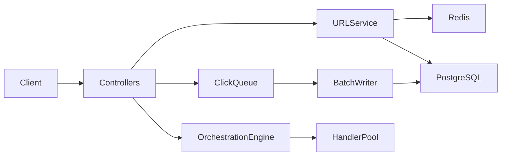

# Architecture and engineering decisions

## Components and data flow

URL shortening validates input, checks alias/code uniqueness, stores a URL and populates Redis.
Redirect resolution is cache-aside. Cached records contain URL ID, target and expiration.
Both cache hits and database results check expiration. Redis TTL is the minimum of configured TTL and remaining lifetime.
The controller chooses 301/302 from resolution metadata without an additional database query.

Click tracking uses a bounded process-local queue. HTTP requests enqueue without waiting for database writes.
A scheduler flushes batches of ten through a separate transactional bean. Each transaction inserts events,
increments URL totals and upserts hour/day/week/month UTC buckets. Failed writes roll back and requeue.
Shutdown stops the scheduler and drains batches until empty or persistence stops making progress.
Queue overflow drops events and emits a warning; this is a documented loss boundary, not durable messaging.

Analytics date ranges are inclusive UTC Instants. Raw events are filtered before bucketing,
so clicks outside a partial bucket's date bounds are excluded. TotalClicks is lifetime total, not range total.
This trades query cost for exact range semantics. Aggregate storage is still populated for future optimization.

## Orchestration

Definitions become a validated DAG. Ready independent tasks execute in a bounded worker pool.
Only one execute batch can reserve a session at a time. Dependencies wait until completed/skipped.
Approval gates block phase execution until approved. The HTTP execute response waits for its batch.
Handlers receive shared concurrent context; successful outputs are published under task definition IDs.

Retry performs one FAILED→IN_PROGRESS transition per attempt and exponential delay; maxRetries counts retries,
not the initial attempt. Exhaustion policy defaults to SKIP. ROLLBACK resets the workflow and pauses it for review.
Pause prevents later tasks/batches starting at checkpoints; it does not interrupt an already-running handler.
Explicit upstream output updates invalidate transitive downstream results and reopen the affected phase.
Replanning and manual rollback reject requests while a batch is executing.

Transitions keep timestamp, states, actor and reason in session memory and JSON logs; audit endpoint exposes them.
Metrics expose task totals, current completed/failed/skipped counts, cumulative retries/rollbacks,
success rate, cumulative handler latency and mean recovery duration. These are not distributed metrics.

## Reliability and security

Database operations use Resilience4j retry and circuit breaker. Business errors are ignored by the breaker.
Redis failures use cache-miss/no-write fallbacks. Health/readiness probe database and Redis.
Bucket4j limits are per IP and process. Spring Security adds CSP, frame and content-type headers.
URL schemes are restricted to HTTP/HTTPS; responses use JSON rather than rendering submitted HTML.
IPs in click records are SHA-256 hashed. JSON logs are structured but messages may contain user-supplied values.

## Limits and alternatives

| Decision | Rationale | Alternative / limitation |
|---|---|---|
| PostgreSQL + transactional batch writer | Atomic events/counters/aggregates | Queue itself is not durable; use a broker for lossless delivery. |
| Redis cache-aside | Cheap repeated redirects with expiry guard | Cache availability degrades to database access. |
| In-memory orchestration | Small local workflow engine | Restart loses sessions/audit; persistence required for durable production orchestration. |
| Fixed handler pool | Bounded parallelism | Handlers must return and manage thread-safe mutable values; timeoutMs is not enforced. |
| JSON logging | Parseable records and stack traces | Log retention, redaction and indexing belong to the deployment platform. |
| Unauthenticated API | Existing demo contract | Protect admin/orchestration at ingress; application ownership/auth is not implemented. |
| Single replica | Process-local limits and workflow state | Distributed rate limits/state needed before scaling. |

## Schema and migrations

Flyway V1 creates URLs, click events/aggregates and orchestration entities. V2 widens generated/alias short-code storage.
Application URL expiry is Instant; PostgreSQL timestamp-with-time-zone fields represent an absolute instant.
Cleanup calls a separate transactional CleanupWorker; dry-run counts without deletes. Real cleanup deletes dependent events/aggregates before URLs.
